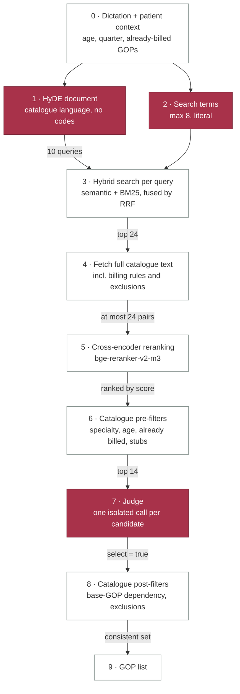

# GOPilot

GOPilot is a local AI assistant for EBM billing code recommendation in German GP practices. Given a doctor's dictation and patient context, it recommends GOP (Gebührenordnungsposition) codes from the EBM 2026 catalogue.

It runs fully offline using a local LLM (Qwen3.5 9B via Ollama) and a local vector database (ChromaDB). Built for research and evaluation, not production use.

## Three modes

The evaluation compares three ways of answering the same question:

| Mode      | What the LLM sees                                                                                                  |
| --------- | ------------------------------------------------------------------------------------------------------------------ |
| **Basic** | dictation + patient context, nothing else                                                                          |
| **RAG**   | the above + top-k semantic retrieval from ChromaDB                                                                 |
| **Agent** | the full pipeline below: query construction, hybrid retrieval, reranking, per-candidate judging, catalogue filters |

No GOP knowledge is hard-coded. Every recommended code has to come out of retrieval — the judge can only say yes to candidates it was handed, so a hallucinated code is structurally impossible.

## The agent pipeline

The core problem is a language mismatch. A dictation is spoken shorthand ("throat red, rapid strep test done"); the EBM catalogue is normative German legalese ("Obligater Leistungsinhalt: …"). The two sit far apart in embedding space, so searching the catalogue with the raw dictation retrieves poorly.

The pipeline works around this by expanding once — rewriting the dictation into catalogue language and fanning out into ten search queries — and then narrowing in five deterministic steps.



Filled steps are LLM calls; outlined steps are deterministic code.

### Step by step

| #   | Step          | What it does                                                                                                                                                                                                                                                                            | Code                                            |
| --- | ------------- | --------------------------------------------------------------------------------------------------------------------------------------------------------------------------------------------------------------------------------------------------------------------------------------- | ----------------------------------------------- |
| 0   | Context       | Reads age, gender, insurance and — importantly — which GOPs are already billed this quarter.                                                                                                                                                                                            | `get_patient()`, `agent.py:247`                 |
| 1   | HyDE document | The model rewrites the dictation as a short, neutral catalogue-style document describing what was done. GOP numbers are forbidden: the document is meant to _search_, not to guess.                                                                                                     | `build_hypothetical_document()`, `agent.py:301` |
| 2   | Search terms  | Up to 8 short literal terms ("spirometry", "home visit"), the counterpart to the HyDE document: something short for BM25 to bite on. Anything resembling a GOP number is stripped out.                                                                                                  | `build_search_plan()`, `agent.py:255`           |
| 3   | Hybrid search | Ten queries run against the catalogue — HyDE document (16 hits), raw dictation (16), each search term (8 each). Every query runs _twice_: semantically over ChromaDB and lexically over a BM25 index, merged by Reciprocal Rank Fusion. Hits accumulate in a pool, deduplicated by GOP. | `search_gops()`, `agent.py:106`                 |
| 4   | Full text     | The top 24 candidates get their complete catalogue entry loaded, including billing rules, annotations and exclusion lists — the retrieval snippets alone are too short to judge on.                                                                                                     | `get_gop_details()`, `agent.py:133`             |
| 5   | Reranking     | A cross-encoder reads query and candidate text _together_ and scores relevance directly. Far more accurate than embedding similarity, far too expensive for the whole catalogue — hence only here, on 24 pairs.                                                                         | `rerank_candidates()`, `agent.py:511`           |
| 6   | Pre-filters   | Drops candidates that are already billed, belong to another specialty's Kapitel III, violate an age limit stated in the GOP text, or are contentless catalogue stubs. The rest is capped at 14.                                                                                         | `agent.py:451-462`                              |
| 7   | Judge         | The actual decision — not "pick from this list" but up to 14 separate yes/no calls, one per candidate. A yes counts only with a verbatim quote from the dictation as evidence. Malformed output, a yes without evidence, or a model error all count as no.                              | `_decide_from_candidates()`, `agent.py:754`     |
| 8   | Post-filters  | A surcharge GOP survives only if its base GOP is billed or also selected (iterated to a fixpoint). Where two selected GOPs exclude each other, the higher-valued one stays.                                                                                                             | `agent.py:929`, `agent.py:853`                  |
| 9   | Result        | A JSON list of GOP codes, plus the tool log, search plan, HyDE document and rerank log for traceability.                                                                                                                                                                                | `agent.py:476-482`                              |

### Why it is built this way

**Retrieval expands before it narrows.** Ten queries against two indexes produce up to 96 raw hits. Reciprocal Rank Fusion merges the semantic and lexical rankings without comparing their incomparable scores — it uses rank position only, so a GOP that both methods rate moderately well beats one that a single method loves. Recall lost at this stage is unrecoverable: the pipeline never retries with a better query.

**The decision is deliberately split.** A 9B model weighs 14 candidates against each other poorly — it picks by position and loses the tail of the list. Binary per-candidate judgements are much more stable, at the cost of 14 of the 16 LLM calls per case.

**Deterministic filters catch what the judge structurally cannot.** Because each candidate is judged in isolation, the approved set can be internally inconsistent: a surcharge without its base code, or two mutually exclusive codes. Two post-filters resolve this on the full set. The specialty and age filters are derived from catalogue structure (Kapitel III preambles, age limits parsed from the GOP text); the stub filter and the "keep the higher-valued code" tie-break are heuristics, not catalogue rules.

**What it does not do.** There is no tool loop — the order of steps is fixed in `run_agent()`, and the model never decides what to do next. "Agentic" here means the task is decomposed into formulate → search → judge, not that the model steers itself.

### Per case, at most

|                               |                                        |
| ----------------------------- | -------------------------------------- |
| LLM calls                     | 16 (1 HyDE + 1 search plan + 14 judge) |
| Search queries                | 10                                     |
| Raw hits before deduplication | 96                                     |
| Full texts loaded             | 24                                     |
| Cross-encoder pairs           | 24                                     |
| Candidates reaching the judge | 14                                     |

All model calls run at `temperature = 0`.

## Setup

Requires [Miniconda](https://docs.conda.io/en/latest/miniconda.html) and a running [Ollama](https://ollama.com/).

```bash
conda env create -f environment.yml
conda activate gopilot
python setup.py   # pulls models, inits DB, fetches + ingests EBM PDF, caches reranker
```

## Usage

```bash
python chat.py                                  # interactive agent chat
python -m src.eval                              # all conditions -> reports/default.json
python -m src.eval --config configs/judge_thinking.yaml
python -m src.eval --runs 3 --verbose           # override run count
python -m src.fetch_ebm                         # re-fetch + re-ingest latest EBM
```

Experiments are defined in `configs/*.yaml` — model, `top_k`, reranker, which conditions to run, and two separate thinking switches: `thinking` for the generative steps (HyDE, search plan) and `judge_thinking` for the per-candidate decision. Reasoning before a binary verdict stabilises judgements. The report is written to `reports/<experiment>.json`.

## Evaluation

20 hand-annotated GP billing cases (`data/test_dictations/`), scored with per-case F1 against ground-truth GOPs.

Current results (avg F1, 20 cases): **basic 0.10 · RAG 0.33 · agent 0.80**. Basic and RAG come from
`reports/default.json` (3 runs), the agent number from the current pipeline in
`reports/catalogue-filters.json` (1 run, agent condition only). Basic and RAG use neither the judge
nor the catalogue filters, so nothing changed for them in between.

Agent F1 as the decision step was tightened:

| Pipeline stage                                                   | Agent F1 |
| ---------------------------------------------------------------- | -------- |
| Bias removed (baseline)                                          | 0.51     |
| + per-candidate judge, full GOP text, exclusion dedup            | 0.60     |
| + judge thinking, evidence-first                                 | 0.73     |
| + catalogue rule filters (base-GOP dependency, range exclusions) | **0.80** |

Caveats on these numbers:

- The test cases were also used while iterating on prompts and retrieval, so these are dev-set numbers. An unbiased estimate needs newly written, held-out cases.
- The agent column bundles HyDE, hybrid retrieval, reranking, per-candidate judging and six filters, so the gap to RAG cannot be attributed to any single one of them.

## Layout

```
src/agent.py     the agent pipeline described above
src/eval.py      evaluation harness, condition definitions, metrics
src/inference.py basic/RAG prompting
src/ingest.py    EBM PDF -> parsed GOP entries -> ChromaDB
src/db.py        patient database
configs/         experiment definitions
reports/         evaluation output
tests/           unit tests (pytest)
```
