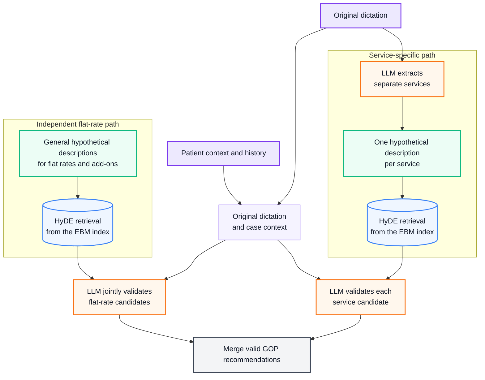

# GOPilot

GOPilot explores AI-assisted billing-code recommendations based on the EBM (Einheitlicher
Bewertungsmaßstab) for German GP practices. Given a doctor's dictation and patient context, it
recommends GOP (Gebührenordnungsposition) codes from the EBM catalogue.

In Germany's statutory health insurance system, the EBM defines billable outpatient medical
services and the conditions attached to them. Practices document these services using GOP codes,
which form the basis for reimbursement.

EBM billing requires substantial domain knowledge because documented services must be matched with
catalogue rules, patient context, and prior contacts. Omitting valid codes can result in lost revenue,
while incorrect codes can cause rejected claims, corrections, or repayment risks.

GOPilot is an exploratory evaluation project, not a production-ready autonomous billing system.
Its main focus is the use of a small local model for billing assistance, as processing highly
sensitive patient data locally would offer practical data-protection benefits.

## Data source

The EBM catalogue comes from the SDEBM (Stammdatei für den EBM) published by the KBV
(Kassenärztliche Bundesvereinigung), not from the PDF:
[update.kbv.de/ita-update/Stammdateien/KBV_Stammdateien/](https://update.kbv.de/ita-update/Stammdateien/KBV_Stammdateien/)

`python setup.py` downloads the installer JAR and extracts record type 850 (the nationwide EBM) as
XML.

Setup writes the catalogue to the versioned Qdrant collection specified by `ebm_collection`.
Retrieval-based runs derive their catalogue quarter from the collection name (for example,
`ebm_2026_q4`).

## Setup

```bash
conda env create -f environment.yml
conda activate gopilot
python setup.py
```

## Current predictors

The following predictors were implemented to compare different strategies:

- **No RAG:** a baseline with no retrieval and no catalogue context; it recommends codes only from
  the dictation and patient context.
- **RAG:** retrieves a fixed set of catalogue candidates before the model makes a recommendation.
- **Agent:** lets the model search and inspect individual catalogue entries through tools before it
  recommends codes.
- **Workflow:** implements an explicit multi-step billing process:
  1. Use a large language model (LLM) to extract every documented service or contact form
     separately from the dictation.
  2. Use each extracted description for Hypothetical Document Embeddings (HyDE) retrieval of EBM
     candidates for that specific service.
  3. Retrieve possible flat rates and add-ons independently using general HyDE descriptions.
  4. Have the LLM validate the retrieved service and flat-rate candidates against the original
     dictation, patient history, annotations and structured billing metadata.
  5. Merge recommendations from both paths.



## Running evaluations

Each test case is an independent snapshot. Its patient history is a fixed input and is never updated
with recommendations from another case. `expected_gops` contains GOPs the system should
submit or recommend and is used only by the evaluator, never as predictor input.

The error rate is the fraction of cases that did not return a usable structured result. The current
evaluation set contains 20 synthetic dictations and 37 expected code occurrences.

Select a configuration from `configs/` to run a generation evaluation:

```bash
# Replace config.yaml with the configuration to evaluate
python -m src.eval.generation --config configs/config.yaml

# Evaluate retrieval coverage independently of generation
python -m src.eval.retrieval --config configs/config.yaml

# Evaluate selected generation cases (repeat --case as needed)
python -m src.eval.generation --config configs/workflow.yaml --case case_003 --case case_005
```

## MLflow

MLflow is used for experiment tracking and tracing. All evaluations write new runs to the hard-coded
`gopilot` experiment. Run names contain the generation strategy and model, for example
`workflow-gemma4:e4b` or `agent-deepseek/deepseek-v4-flash`.

Start the local MLflow dashboard from the repository root:

```powershell
mlflow ui --backend-store-uri sqlite:///mlflow.db --default-artifact-root .\mlruns --host 127.0.0.1 --port 5000
```

Open http://127.0.0.1:5000 in the browser.

## Preliminary evaluation results

### Local model results

| Strategy | Precision | Recall |    F1 | Error rate |
| -------- | --------: | -----: | ----: | ---------: |
| No RAG   |     0.161 |  0.135 | 0.147 |      0.000 |
| RAG      |     0.381 |  0.216 | 0.276 |      0.050 |
| Agent    |     0.308 |  0.216 | 0.254 |      0.000 |
| Workflow |     0.618 |  0.568 | 0.592 |      0.000 |

The more structured workflow performs best with the small local model, but its F1 score of 0.592
remains too low for reliable billing recommendations.

### Cloud results

Although the project focuses on local inference with a small model, comparison runs with the larger
cloud model `deepseek/deepseek-v4-flash` were conducted to assess the impact of model capability.

| Strategy | Precision | Recall |    F1 | Error rate |
| -------- | --------: | -----: | ----: | ---------: |
| No RAG   |     0.326 |  0.378 | 0.350 |      0.050 |
| RAG      |     1.000 |  0.324 | 0.490 |      0.000 |
| Agent    |     0.938 |  0.811 | 0.870 |      0.000 |
| Workflow |     0.903 |  0.757 | 0.824 |      0.000 |

Catalogue access is decisive: No RAG is imprecise, while RAG is too conservative and finds only 12
of 37 expected codes. The agent achieves the best F1, followed closely by the more explicit workflow.
Overall, all retrieval-based strategies benefit substantially from the larger cloud model compared
with their local-model counterparts.

### Possible future directions

- Build a larger, independently reviewed evaluation set, ideally including
  de-identified real-world dictations.
- Parse and expose more official XML relationships, especially exclusions, dependencies and other
  rules that are not yet represented in the current metadata.
- Representing the EBM as a queryable graph (GraphRAG) could improve retrieval and reasoning by
  making relationships and dependencies between GOPs explicit.
